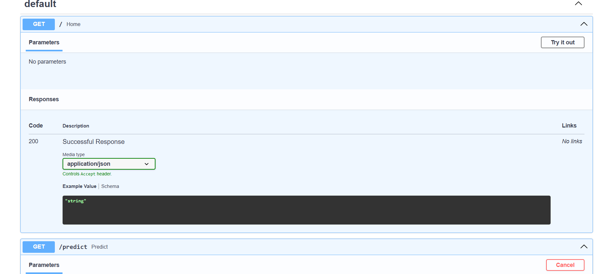
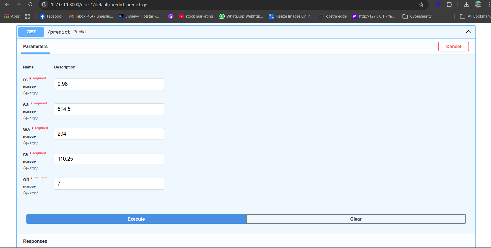
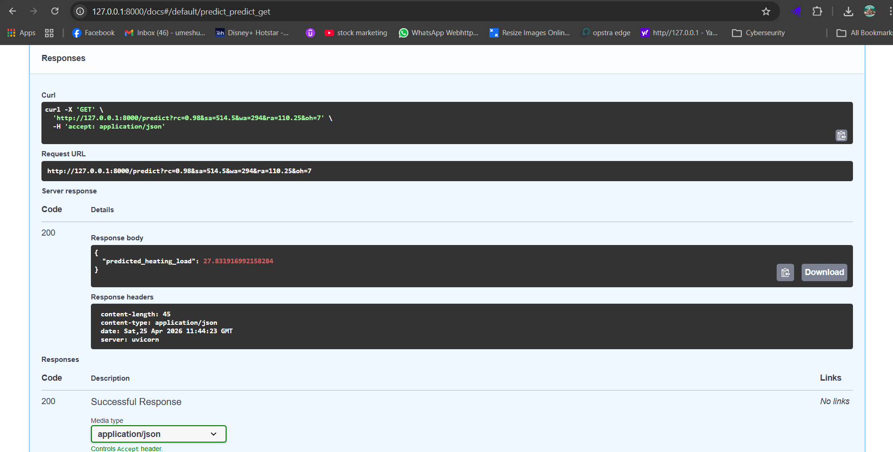
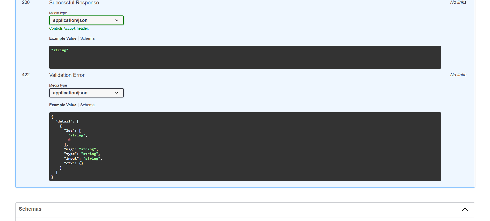

# Energy Intelligence Prediction API

> A cloud-deployed machine learning system that predicts building energy performance and provides actionable recommendations for energy efficiency and Net Zero goals.

---

## 🚀 Live API

👉 https://YOUR-LINK.onrender.com/docs  

Test the system using the interactive FastAPI documentation.

---

## 📌 Key Highlights

- Built an end-to-end ML pipeline using a real-world energy dataset (768 samples)
- Implemented data cleaning and feature engineering using pandas
- Compared multiple models and selected the best (Random Forest)
- Designed a REST API using FastAPI for real-time predictions
- Deployed the system to the cloud (Render)

---

## 🚀 Features

- Data preprocessing and transformation pipeline
- Feature engineering based on building characteristics
- Machine learning model for heating load prediction
- Model comparison (Linear Regression vs Random Forest)
- Production-style API with validation and structured responses
- Business logic layer providing energy insights and recommendations

---

## 🧠 How It Works

1. Load building energy dataset  
2. Clean data (remove missing values and duplicates)  
3. Select key features:
   - Relative Compactness  
   - Surface Area  
   - Wall Area  
   - Roof Area  
   - Overall Height  
4. Train and evaluate multiple regression models  
5. Select the best-performing model  
6. Save the model (`model.pkl`)  
7. Serve predictions through a FastAPI endpoint  

---

## 📸 API Demo

### 1. FastAPI Documentation


### 2. Input Parameters


### 3. Execution


### 4. Prediction Output


---

## 📊 Example Usage

**Endpoint:**
POST /predict-heating-load


**Input:**
```json
{
  "rc": 0.98,
  "sa": 514.5,
  "wa": 294,
  "ra": 110.25,
  "oh": 7
}

Output:

{
  "predicted_heating_load": 27.73,
  "energy_category": "High",
  "recommendation": "Energy efficiency improvement recommended"
}
🛠️ Tech Stack
Python
pandas
scikit-learn
FastAPI
Uvicorn
Render (Deployment)

---

## 📁 Project Structure
energy-intelligence-prediction-api/
├── data/
│ ├── energy_data.csv
│ └── processed_data.csv
├── pipeline/
│ ├── process_data.py
│ └── train_model.py
├── api.py
├── main.py
├── requirements.txt
└── README.md


---

## ▶️ How to Run

```bash
pip install -r requirements.txt
uvicorn api:app --reload

🌐 API Endpoints
Home:
http://127.0.0.1:8000
Prediction:
http://127.0.0.1:8000/predict?rc=0.98&sa=514.5&wa=294&ra=110.25&oh=7

🎯 Purpose

This project demonstrates a complete machine learning workflow, from data preprocessing and model training to API deployment, simulating a real-world energy intelligence system.

📌 Future Improvements
Use advanced models (Random Forest, XGBoost)
Deploy API to cloud (AWS / Render)
Add frontend dashboard
Integrate larger datasets

---

# 🚀 After pasting

Run:

```powershell
git add README.md
git commit -m "Upgrade README to professional level"
git push
## 📊 Example

**Input:**
